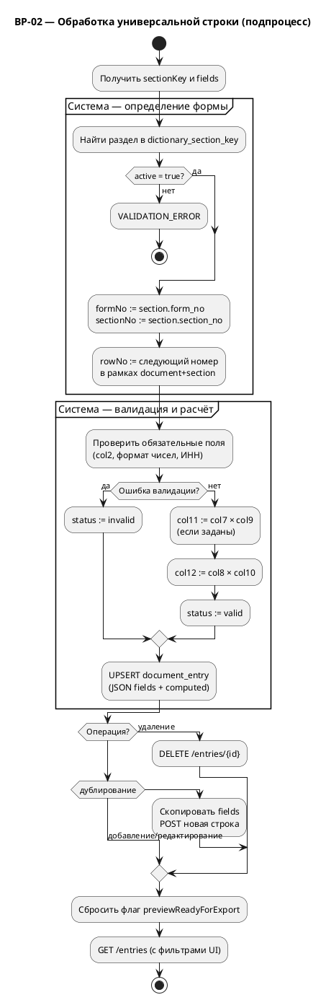
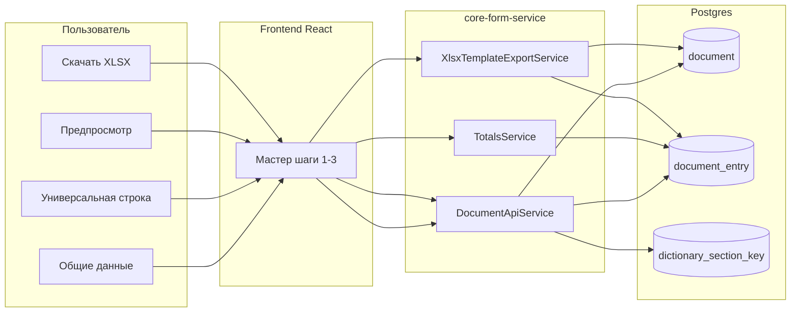

# BPMN 2.0: бизнес-процессы Project-A (MVP)

**Версия:** 2026-06-01  
**Scope:** заполнение форм 4, 5, 6 и экспорт в Excel по шаблону приказа  
**Источники:** TZ-007..TZ-009, `API_SPEC.md`, `mapping-spec.md`, реализация `frontend` + `core-form-service`

---

## Каталог процессов

| ID | Название | Тип | Участники |
|---|---|---|---|
| BP-01 | Заполнение пакета форм 4/5/6 и экспорт | Основной (collaboration) | Пользователь, Система |
| BP-02 | Обработка универсальной строки | Подпроцесс (вызывается из BP-01) | Пользователь, Система |

---

## Условные обозначения (BPMN 2.0)

| Элемент | Обозначение в диаграммах |
|---|---|
| Start Event | `( )` — круг |
| End Event | `(●)` — жирный круг |
| User Task | прямоугольник со скруглением, иконка человека |
| Service Task | прямоугольник, автоматизированное действие |
| Exclusive Gateway (XOR) | ромб `×` |
| Parallel Gateway (AND) | ромб `+` |
| Sequence Flow | сплошная стрелка |
| Message Flow | пунктир (между пулами) |
| Sub-process | прямоугольник с `+` |

---

## BP-01: Заполнение пакета форм 4/5/6 и экспорт

### Описание

Сквозной бизнес-процесс MVP: пользователь создаёт документ-пакет, один раз вводит общий блок, добавляет произвольное число строк через «универсальную строку» (форма определяется по разделу), проверяет агрегаты и выгружает `.xlsx`, совместимый с утверждённым шаблоном.

### Collaboration (пулы)

```plantuml
@startuml BP-01-main-process
!pragma useVerticalIf on
skinparam shadowing false
skinparam defaultFontName Arial
skinparam activity {
  BackgroundColor #F8F9FA
  BorderColor #333
}
title BP-01 — Заполнение пакета форм 4/5/6 и экспорт (MVP)

|Пользователь|
start
:Открыть мастер ввода;
if (Есть сохранённый documentId?) then (да)
  :Загрузить документ по ID;
else (нет)
endif

:Шаг 1 — заполнить общий блок\n(наименование/шифр, этап,\nотчётный и плановый год);
:Сохранить черновик\n(создать или обновить документ);

|Система|
:POST/PATCH /documents\nсохранить common в Postgres;

|Пользователь|
:Перейти к шагу 2;

repeat
  :Выбрать раздел из справочника;
  |Система|
  :GET /dictionaries;
  :Определить formNo по sectionKey\n(4/5/6, без ручного выбора формы);
  if (Раздел исключён?\nreturn_waste_f4/f5) then (да)
    :VALIDATION_ERROR\n(раздел недоступен);
    stop
  else (нет)
  endif
  |Пользователь|
  :Заполнить поля строки\n(col2..col10, col13_1/2, col14, col15);
  |Система|
  :Валидация полей\n(числа, ИНН, 2 знака после запятой);
  if (Данные валидны?) then (нет)
    :validationStatus = invalid;
    :Вернуть VALIDATION_ERROR;
  else (да)
    :Рассчитать col11, col12\n(норма × цена);
    :Сохранить Entry\nPOST/PATCH /entries;
    :validationStatus = valid;
  endif
  |Пользователь|
  if (Нужны ещё строки\nили правки?) then (да)
  else (нет)
  endif
repeat while (да) is (да)
->нет;

:Перейти к шагу 3 — предпросмотр;
|Система|
fork
  :GET /entries (все строки);
fork again
  :GET /totals\nагрегаты по формам 4/5/6;
end fork
:Отметить preview актуальным;

|Пользователь|
if (Есть строки с invalid?) then (да)
  :Просмотреть список ошибок;
  :Перейти к проблемной строке\n(шаг 2, редактирование);
  detach
else (нет)
endif

if (Агрегаты корректны?) then (нет)
  :Вернуться к шагу 2\nи исправить строки;
  detach
else (да)
endif

:Нажать «Сформировать Excel»;

|Система|
if (previewReadyForExport?) then (нет)
  :Блокировка экспорта\n(данные изменились после preview);
  stop
else (да)
endif
if (entriesCount > 0?) then (нет)
  :VALIDATION_ERROR\n«Нет строк для экспорта»;
  stop
else (да)
endif
:POST /export (format=xlsx,\nmode=fill_template);
:Заполнить шаблон XLSX\n(листы Ф.4, Ф.5, Ф.6);
:Сохранить файл, вернуть downloadUrl;
:GET /files/{fileId} — скачать blob;

|Пользователь|
:Сохранить .xlsx локально;
stop

@enduml
```

### Ключевые шлюзы (BP-01)

| Gateway | Условие «да» | Условие «нет» |
|---|---|---|
| Есть documentId? | `GET /documents/{id}` | `POST /documents` |
| Раздел исключён? | Ошибка, стоп | Продолжить ввод |
| Данные валидны? | Сохранение + расчёт | `invalid`, показать ошибку |
| Есть invalid-строки? | Переход к исправлению | К экспорту |
| previewReady? | Экспорт | Блокировка UI |
| entriesCount > 0? | Заполнение шаблона | Ошибка API |

### Маппинг раздел → форма (автоопределение)

| sectionKey | Форма | Раздел (label) | MVP |
|---|---:|---|:---:|
| `raw_materials` | 4 | Сырье и основные материалы | ✓ |
| `aux_materials` | 4 | Вспомогательные материалы | ✓ |
| `return_waste_f4` | 4 | Возвратные отходы | ✗ (деактивирован) |
| `purchased_semi` | 5 | Покупные полуфабрикаты | ✓ |
| `return_waste_f5` | 5 | Возвратные отходы | ✗ (деактивирован) |
| `components` | 6 | Комплектующие изделия | ✓ |

---

## BP-02: Обработка универсальной строки (подпроцесс)

Вызывается циклически на шаге 2 BP-01 при добавлении, редактировании, дублировании или удалении строки.

---

## Диаграмма потоков данных (дополнение к BPMN)

Связь задач BP-01 с API и хранилищем:

---

## Сценарии приёмки на диаграмме (TZ-009)

| Сценарий | Путь на BP-01 |
|---|---|
| AC-01: 0 строк | Цикл ввода пропущен → preview пустой → экспорт заблокирован |
| AC-02: 1 строка | 1 итерация BP-02 → totals → export |
| AC-03: N строк | N итераций BP-02 → totals по 4/5/6 → export |
| AC-04: невалидные числа | Gateway «Данные валидны?» → ветка invalid |
| AC-05: исправление | Откат к шагу 2 → повтор preview → export |

---

## Как отрисовать

1. **draw.io (BPMN 2.0, бизнес-язык)** — готовый файл collaboration:
   - `ТЗ/diagrams/bpmn-bp01-collaboration.drawio`
   - Вкладка **BP-01** — основной процесс (пулы «Пользователь» и «Система учёта ТРУ», User/Service Task, XOR/AND, Message Flow).
   - Вкладка **BP-02** — подпроцесс универсальной строки.
   - Открыть: [app.diagrams.net](https://app.diagrams.net) → File → Open, либо расширение Draw.io Integration в Cursor.
2. **PlantUML** (текстовый BPMN-черновик): скопируйте блок `@startuml` … `@enduml` в [plantuml.com](https://www.plantuml.com/plantuml) или расширение VS Code/Cursor «PlantUML».
3. **Camunda Modeler / bpmn.io**: импортируйте логику вручную по таблицам шлюзов выше или из draw.io (Export as → BPMN 2.0 XML при необходимости).
4. **Mermaid**: блок «Диаграмма потоков данных» рендерится в GitHub/GitLab preview.

---

## Вне scope MVP (на диаграмме не показано)

- Формы 1, 2, 7, 20 (исключены из MVP 2026-05-09).
- Аутентификация и роли пользователей.
- Публикация документа (статус остаётся `draft`).
- Автосохранение черновика на каждом шаге (открытый вопрос TZ-007).
